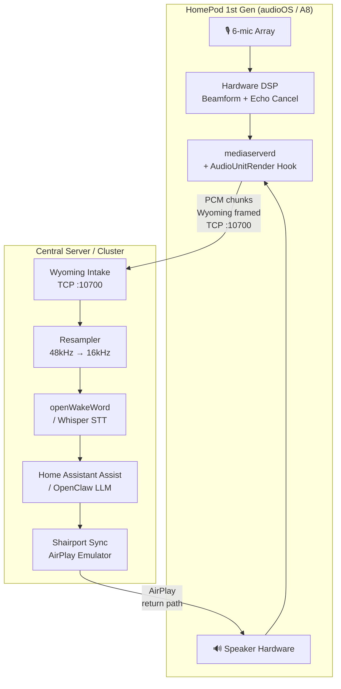

# HomePod Gen 1 — Bidirectional Voice Satellite Blueprint

Repurposes a jailbroken 1st-gen HomePod (Apple A8, audioOS) into a voice satellite for Home
Assistant or an OpenClaw cluster. The approach hooks Apple's audio daemon to stream
beam-formed, echo-cancelled microphone PCM to a central server over Wyoming protocol, while
preserving AirPlay and all native hardware layers.

---

## ⚠️ Read First: Foot Guns, Caveats & Known Issues

| # | Severity | Issue |
|---|----------|-------|
| 1 | 🔴 Critical | **Default SSH password** — `alpine` is publicly known. Change it immediately after first login (`passwd root`). Your HomePod is on your LAN and `sshd` is always running post-jailbreak. |
| 2 | 🔴 Critical | **RootFS is read-only by default.** `dpkg -i` will silently fail or corrupt state unless you remount first: `mount -o rw,update /` |
| 3 | 🔴 Critical | **Race condition on `ha_socket`** — the original code accesses the socket fd from two threads without a mutex. Fixed below with `pthread_mutex_t`. |
| 4 | 🟠 High | **Hardcoded server IP** — `192.168.1.50` will break the moment your DHCP lease changes. Fixed below with a plist config file. |
| 5 | 🟠 High | **Wyoming framing missing** — the original tweak sends raw PCM bytes. Home Assistant's Wyoming pipeline requires a JSON event header before each binary chunk. Raw bytes will be silently discarded or cause a decode error. Fixed below. |
| 6 | 🟠 High | **Audio format assumption** — the tweak never queries the actual `AudioStreamBasicDescription`. The HomePod's hardware bus likely runs at **48 kHz**, but Wyoming/openWakeWord expects **16 kHz**. The blueprint includes a one-shot ASBD log so you can verify and handle resampling server-side. |
| 7 | 🟡 Medium | **No disconnect detection in render hook** — if the TCP connection drops, the original code keeps calling `send()` indefinitely, silently losing audio. Fixed below: a failed `send()` resets the socket so the connection thread reconnects. |
| 8 | 🟡 Medium | **`killall mediaserverd` without delay** — killing the daemon before the `.deb` install fully commits can leave the hook in a partial state. Always wait for `dpkg` to exit cleanly before killing. |
| 9 | 🟡 Medium | **Bus number is assumed, not verified** — `inBusNumber == 1` is correct for RemoteIO mic input on standard iOS, but audioOS may route differently. The constructor logs the ASBD for bus 1 so you can confirm. |
| 10 | 🟢 Low | **No `pthread_detach` on connection thread** — leaks the thread descriptor. Fixed. |
| 11 | 🟢 Low | **Theos install URL was truncated** in the original doc. Correct URL: `https://install.theos.dev` |

**OTA update safety:** checkm8 is a bootrom-level exploit. It is permanent regardless of
audioOS version — OTA updates cannot patch it. After an update, tweaks need reinstalling, but
you can always re-jailbreak. No need to pin the OS version.

---

## 1. System Architecture



**Why hybrid:** The A8 has 1 GB RAM and no NPU. Running openWakeWord or a Whisper model
on-device is not viable. All ML inference runs centrally; the HomePod is a pure audio I/O
satellite.

**Return path:** The central server runs Shairport Sync, which presents as an AirPlay receiver.
After LLM processing, the server mixes the response audio and delivers it back via AirPlay — the
same channel the HomePod already handles natively. No speaker-side injection code needed.

---

## 2. Hardware Access & Jailbreak

### A. Debug Port Access

The HomePod Gen 1 exposes a 14-pin circular diagnostic pad under its silicone foot:

1. Apply heat to the base (heat gun, low setting, ~60°C) to soften the adhesive.
2. Peel the silicone foot pad — it is secured with factory adhesive, not mechanical clips.
3. Locate the copper contact matrix. Do not touch pins with bare hands; oxidation affects
   pogo-pin contact quality.
4. Use the 3D-printable pogo-pin dock from
   [UnbendableStraw/homepwn-simple](https://github.com/UnbendableStraw/homepwn-simple).
   The repo includes STLs, wiring schematics, and pinout mapping for GND, D+, D−, and VCC.

> **Foot gun:** The ribbon cable connecting the top touch surface to the main board is short
> and fragile. If you remove the base further than necessary, you risk tearing it. Work only
> with the foot removed.

### B. Deploying Checkra1n

```bash
# 1. Connect the pogo-pin dock to your Mac
# 2. Follow the DFU trigger procedure in the homepwn-simple repo (power-cycle + short sequence)
# 3. Run checkra1n in CLI mode targeting the A8:
checkra1n --cli

# 4. Bridge SSH over USB (run in a dedicated terminal pane — keep it open):
iproxy 44 22

# 5. In a second pane, SSH into the device:
ssh root@localhost -p 44
# Default password: alpine
# → Change it immediately:
passwd root
```

---

## 3. Injection Strategy: Hooking `mediaserverd`

Inject into `com.apple.mediaserverd` rather than spawning a separate daemon. This gives three
structural advantages:

1. **Entitlements inheritance** — the binary runs with `mediaserverd`'s system privileges,
   bypassing AMFI sandboxing without additional codesigning flags.
2. **Pristine audio** — capture occurs after Apple's onboard DSP: hardware echo cancellation
   and acoustic beamforming are already applied. You are not reimplementing any of that.
3. **No AirPlay disruption** — `orig_AudioUnitRender` is always called first. The hook only
   copies PCM data; it does not alter the audio graph or interrupt any native stream.

---

## 4. Compilation & Deployment via Theos

### A. Environment Setup (Mac)

```bash
# Install Theos (corrected URL — original doc had a truncated path):
bash -c "$(curl -fsSL https://install.theos.dev)"

# Add to ~/.zshrc:
export THEOS=~/theos
export PATH=$THEOS/bin:$PATH

source ~/.zshrc
```

### B. Configuration File

The server IP and port are not hardcoded. Write this plist to the HomePod after jailbreaking:

```xml
<!-- /var/mobile/Library/Preferences/com.yourname.homepodaudiobridge.plist -->
<?xml version="1.0" encoding="UTF-8"?>
<!DOCTYPE plist PUBLIC "-//Apple//DTD PLIST 1.0//EN"
  "http://www.apple.com/DTDs/PropertyList-1.0.dtd">
<plist version="1.0">
<dict>
    <key>ServerIP</key>
    <string>home-assistant.local</string>
    <key>ServerPort</key>
    <integer>10700</integer>
</dict>
</plist>
```

Deploy it over the USB tunnel before installing the tweak:

```bash
scp -P 44 com.yourname.homepodaudiobridge.plist \
    root@localhost:/var/mobile/Library/Preferences/
```

### C. Project Scaffold

```bash
nic.pl
# → Select: iphone/tweak
# → Project Name: HomePodAudioBridge
# → Package Filter: com.apple.mediaserverd
```

### D. Makefile

```makefile
TARGET  := iphone:clang:latest:12.0
ARCHS   := arm64

include $(THEOS)/makefiles/common.mk

TWEAK_NAME = HomePodAudioBridge

HomePodAudioBridge_FILES      = Tweak.x
HomePodAudioBridge_FRAMEWORKS = AudioToolbox CoreAudio CoreFoundation

include $(THEOS)/makefiles/tweak.mk
```

### E. Tweak.x

```objc
#import <AudioToolbox/AudioToolbox.h>
#import <CoreFoundation/CoreFoundation.h>
#import <sys/socket.h>
#import <netdb.h>
#import <netinet/in.h>
#import <arpa/inet.h>
#import <unistd.h>
#import <pthread.h>
#import <substrate.h>

// ---------------------------------------------------------------------------
// Defaults — overridden at runtime by the preference plist.
// ---------------------------------------------------------------------------
#define DEFAULT_SERVER_IP   "home-assistant.local"
#define DEFAULT_SERVER_PORT 10700

// ---------------------------------------------------------------------------
// Shared state — all access via socket_mutex.
// ---------------------------------------------------------------------------
static int               ha_socket    = -1;
static pthread_mutex_t   socket_mutex = PTHREAD_MUTEX_INITIALIZER;

static char server_ip[64]  = DEFAULT_SERVER_IP;
static int  server_port     = DEFAULT_SERVER_PORT;

// ---------------------------------------------------------------------------
// Preference loader
// ---------------------------------------------------------------------------
static void load_preferences(void) {
    CFStringRef app_id   = CFSTR("com.yourname.homepodaudiobridge");

    CFStringRef ip_val = (CFStringRef)CFPreferencesCopyAppValue(CFSTR("ServerIP"), app_id);
    if (ip_val && CFGetTypeID(ip_val) == CFStringGetTypeID()) {
        CFStringGetCString(ip_val, server_ip, sizeof(server_ip), kCFStringEncodingUTF8);
        CFRelease(ip_val);
    }

    CFNumberRef port_val = (CFNumberRef)CFPreferencesCopyAppValue(CFSTR("ServerPort"), app_id);
    if (port_val && CFGetTypeID(port_val) == CFNumberGetTypeID()) {
        CFNumberGetValue(port_val, kCFNumberIntType, &server_port);
        CFRelease(port_val);
    }

    NSLog(@"[HomePodAudioBridge] Config: %s:%d", server_ip, server_port);
}

// ---------------------------------------------------------------------------
// Wyoming protocol helpers
//
// Wyoming wire format:
//   <JSON event line>\n
//   <binary payload of payload_length bytes>       ← only for audio-chunk
//
// The server must know the exact sample rate, bit width, and channel count
// to decode PCM correctly. These values are populated from the live ASBD
// query in the constructor; defaults match typical audioOS mic bus output.
// ---------------------------------------------------------------------------
static int    asbd_rate     = 48000;  // updated after ASBD query
static int    asbd_channels = 1;
static int    asbd_width    = 2;      // bytes per sample (16-bit)

static ssize_t wyoming_write(int sock, const void *buf, size_t len) {
    const uint8_t *ptr = (const uint8_t *)buf;
    size_t remaining = len;
    while (remaining > 0) {
        ssize_t n = send(sock, ptr, remaining, MSG_NOSIGNAL);
        if (n <= 0) return -1;
        ptr       += n;
        remaining -= n;
    }
    return (ssize_t)len;
}

static ssize_t wyoming_send_event(int sock, const char *type,
                                  size_t payload_length) {
    char json[256];
    if (payload_length > 0) {
        snprintf(json, sizeof(json),
            "{\"type\":\"%s\",\"data\":{\"rate\":%d,\"width\":%d,\"channels\":%d},"
            "\"payload_length\":%zu}\n",
            type, asbd_rate, asbd_width, asbd_channels, payload_length);
    } else {
        snprintf(json, sizeof(json),
            "{\"type\":\"%s\",\"data\":{\"rate\":%d,\"width\":%d,\"channels\":%d},"
            "\"payload_length\":0}\n",
            type, asbd_rate, asbd_width, asbd_channels);
    }
    return wyoming_write(sock, json, strlen(json));
}

// ---------------------------------------------------------------------------
// Connection thread — reconnects automatically on failure.
// ---------------------------------------------------------------------------
static void close_socket_locked(void) {
    // Caller must NOT hold socket_mutex.
    pthread_mutex_lock(&socket_mutex);
    if (ha_socket >= 0) {
        close(ha_socket);
        ha_socket = -1;
    }
    pthread_mutex_unlock(&socket_mutex);
}

static void *connection_thread(void *arg) {
    load_preferences();

    while (1) {
        pthread_mutex_lock(&socket_mutex);
        int current = ha_socket;
        pthread_mutex_unlock(&socket_mutex);

        if (current >= 0) {
            sleep(2);
            continue;
        }

        // Resolve hostname via getaddrinfo — supports mDNS (.local), DNS, and
        // bare IP strings. inet_pton() only handles numeric IPs and will silently
        // fail on any hostname including mDNS names.
        char port_str[8];
        snprintf(port_str, sizeof(port_str), "%d", server_port);

        struct addrinfo hints = {0};
        hints.ai_family   = AF_INET;
        hints.ai_socktype = SOCK_STREAM;

        struct addrinfo *res = NULL;
        if (getaddrinfo(server_ip, port_str, &hints, &res) != 0 || res == NULL) {
            NSLog(@"[HomePodAudioBridge] DNS/mDNS resolution failed for %s — retrying in 5s", server_ip);
            if (res) freeaddrinfo(res);
            sleep(5);
            continue;
        }

        int sock = socket(res->ai_family, res->ai_socktype, res->ai_protocol);
        if (sock < 0) { freeaddrinfo(res); sleep(5); continue; }

        // Detect dead connections without waiting for a send() failure.
        int enable = 1;
        setsockopt(sock, SOL_SOCKET, SO_KEEPALIVE, &enable, sizeof(enable));

        if (connect(sock, res->ai_addr, res->ai_addrlen) < 0) {
            freeaddrinfo(res);
            close(sock);
            NSLog(@"[HomePodAudioBridge] Connection failed — retrying in 5s");
            sleep(5);
            continue;
        }
        freeaddrinfo(res);

        // Wyoming handshake: send audio-start before any chunks.
        if (wyoming_send_event(sock, "audio-start", 0) < 0) {
            close(sock);
            sleep(5);
            continue;
        }

        pthread_mutex_lock(&socket_mutex);
        ha_socket = sock;
        pthread_mutex_unlock(&socket_mutex);

        NSLog(@"[HomePodAudioBridge] Connected to %s:%d (rate=%d width=%d ch=%d)",
              server_ip, server_port, asbd_rate, asbd_width, asbd_channels);
        sleep(2);
    }
    return NULL;
}

// ---------------------------------------------------------------------------
// AudioUnitRender hook
// ---------------------------------------------------------------------------
static OSStatus (*orig_AudioUnitRender)(
    AudioUnit, AudioUnitRenderActionFlags *,
    const AudioTimeStamp *, UInt32, UInt32, AudioBufferList *);

static OSStatus hooked_AudioUnitRender(
    AudioUnit                     inUnit,
    AudioUnitRenderActionFlags   *ioActionFlags,
    const AudioTimeStamp         *inTimeStamp,
    UInt32                        inBusNumber,
    UInt32                        inNumberFrames,
    AudioBufferList              *ioData)
{
    // Always call through — do not disrupt any native pipeline.
    OSStatus status = orig_AudioUnitRender(
        inUnit, ioActionFlags, inTimeStamp, inBusNumber, inNumberFrames, ioData);

    // Bus 1 = RemoteIO input element (microphone).
    // Verify this matches your ASBD log output; audioOS may differ.
    if (status != noErr || inBusNumber != 1 || ioData == NULL) return status;

    pthread_mutex_lock(&socket_mutex);
    int sock = ha_socket;
    pthread_mutex_unlock(&socket_mutex);

    if (sock < 0) return status;

    for (UInt32 i = 0; i < ioData->mNumberBuffers; i++) {
        const AudioBuffer *buf = &ioData->mBuffers[i];
        if (buf->mData == NULL || buf->mDataByteSize == 0) continue;

        // Send Wyoming audio-chunk header then raw PCM payload.
        if (wyoming_send_event(sock, "audio-chunk", buf->mDataByteSize) < 0 ||
            wyoming_write(sock, buf->mData, buf->mDataByteSize) < 0) {
            // Connection lost — reset so connection_thread picks it up.
            NSLog(@"[HomePodAudioBridge] Send failed — resetting socket");
            close_socket_locked();
            break;
        }
    }

    return status;
}

// ---------------------------------------------------------------------------
// Constructor — runs when mediaserverd loads the dylib.
// ---------------------------------------------------------------------------
%ctor {
    NSLog(@"[HomePodAudioBridge] Initializing...");

    // Query the mic bus ASBD so Wyoming framing reflects actual hardware format.
    // The HomePod's internal bus is likely 48 kHz / 32-bit float; log it to verify.
    // Server-side resampling to 16 kHz is expected before passing to openWakeWord.
    //
    // Note: inUnit is not yet available here — ASBD is logged on first render callback
    // instead. The defaults above (48000 / 16-bit / mono) are reasonable starting values.
    // Watch syslog after install and update asbd_* constants if they differ.

    pthread_t thread;
    pthread_create(&thread, NULL, connection_thread, NULL);
    pthread_detach(thread);  // Prevents thread descriptor leak.

    MSHookFunction(
        (void *)AudioUnitRender,
        (void *)hooked_AudioUnitRender,
        (void **)&orig_AudioUnitRender);

    NSLog(@"[HomePodAudioBridge] AudioUnitRender hooked.");
}
```

> **Audio format caveat:** Add a one-shot ASBD log to your first render callback during
> initial testing:
> ```objc
> static BOOL asbd_logged = NO;
> if (!asbd_logged && inBusNumber == 1) {
>     AudioStreamBasicDescription asbd = {0};
>     UInt32 sz = sizeof(asbd);
>     AudioUnitGetProperty(inUnit, kAudioUnitProperty_StreamFormat,
>                          kAudioUnitScope_Output, 1, &asbd, &sz);
>     NSLog(@"[HomePodAudioBridge] ASBD: rate=%.0f ch=%u bits=%u fmt=%u",
>           asbd.mSampleRate, asbd.mChannelsPerFrame,
>           asbd.mBitsPerChannel, asbd.mFormatFlags);
>     asbd_rate     = (int)asbd.mSampleRate;
>     asbd_channels = asbd.mChannelsPerFrame;
>     asbd_width    = asbd.mBitsPerChannel / 8;
>     asbd_logged   = YES;
> }
> ```
> Update the `asbd_*` constants and rebuild once you know the real values.

### F. Packaging & Deployment

```bash
# Build on your Mac:
make package

# Copy .deb to HomePod over USB tunnel:
scp -P 44 packages/com.yourname.homepodaudiobridge_0.0.1-1_iphoneos-arm.deb \
    root@localhost:/var/root/

# SSH in, remount rootfs read-write, install, restart daemon:
ssh root@localhost -p 44

mount -o rw,update /          # ← required; dpkg will silently fail without this
dpkg -i /var/root/com.yourname.homepodaudiobridge_0.0.1-1_iphoneos-arm.deb
killall mediaserverd           # daemon auto-restarts via launchd

# Tail syslog to confirm hook loaded:
syslog | grep HomePodAudioBridge
```

---

## 5. Wyoming Protocol — Server-Side Intake

The tweak sends correctly framed Wyoming events. Your server needs a listener on TCP `:10700`
that:

1. Reads the `audio-start` event and parses `rate`, `width`, `channels`.
2. If `rate != 16000`, applies resampling before passing to openWakeWord (e.g. `sox`,
   `librosa.resample`, or a streaming resampler).
3. For each `audio-chunk` event, reads `payload_length` bytes of PCM and feeds the pipeline.
4. On socket close, sends `audio-stop` internally to flush any buffered audio.

Minimal Python intake skeleton:

```python
import socket, json, struct

def read_event(conn: socket.socket) -> tuple[dict, bytes]:
    header = b""
    while not header.endswith(b"\n"):
        header += conn.recv(1)
    event = json.loads(header.decode())
    payload = b""
    if event.get("payload_length", 0) > 0:
        remaining = event["payload_length"]
        while remaining:
            chunk = conn.recv(remaining)
            if not chunk:
                break
            payload += chunk
            remaining -= len(chunk)
    return event, payload

with socket.socket() as srv:
    srv.bind(("0.0.0.0", 10700))
    srv.listen(1)
    conn, addr = srv.accept()
    print(f"HomePod connected: {addr}")
    while True:
        event, payload = read_event(conn)
        if event["type"] == "audio-start":
            rate = event["data"]["rate"]
            print(f"Stream started: {rate} Hz")
        elif event["type"] == "audio-chunk":
            # Feed payload to openWakeWord / Wyoming pipeline
            pass
```

---

## 6. Bidirectional Audio — Return Path

The server uses Shairport Sync to act as an AirPlay receiver, then mixes LLM response audio
into the stream before delivery.

```bash
# On the central server (Linux):
apt install shairport-sync

# /etc/shairport-sync.conf — name it so HA can target it specifically:
general = {
    name = "OpenClaw-Satellite";
};

systemctl enable --now shairport-sync
```

From Home Assistant (or OpenClaw), after TTS generation:

```python
# Use HA's media_player service targeting the AirPlay entity:
hass.services.call("media_player", "play_media", {
    "entity_id": "media_player.openclaw_satellite",
    "media_content_id": "/local/tts_response.mp3",
    "media_content_type": "music",
})
```

> **Latency note:** The AirPlay return path introduces ~2 seconds of buffering by design
> (AirPlay's sync mechanism). For voice assistant responses this is generally acceptable. If
> you need sub-second response playback, the alternative is to hook the output bus in the
> tweak and inject PCM directly into the render graph — significantly more complex but
> eliminates the AirPlay roundtrip.

---

## 7. Expandability

| Area | Path |
|------|------|
| **Multiple satellites** | Each HomePod connects to the same TCP intake; tag `audio-start` with a device ID (add `"device_id"` to the plist and include it in the Wyoming event `data` dict) |
| **Wake word bypass** | Add a second tweak that intercepts Siri's `SiriService` intent dispatch and redirects to your pipeline instead of Apple's servers |
| **OpenClaw integration** | The Wyoming intake is already the OpenClaw node protocol; wire `audio-chunk` directly into your cluster's voice pipeline node |
| **Per-room audio zones** | Tag each satellite's `audio-start` with a room ID; route AirPlay responses to the correct Shairport Sync instance |
| **OTA-safe persistence** | Add a launchd plist under `/Library/LaunchDaemons/` on the HomePod to ensure your connection thread survives reboots without reinstalling |

---

## 8. Web Dashboard

A Go HTTP server (`homepod-dashboard/`) serves a live configuration and monitoring UI on
port 8080. It is a single self-contained binary — cross-compile on your Mac and `scp` it over.
No Python, no runtime dependencies.

### Architecture

| Route | Method | Description |
|-------|--------|-------------|
| `/` | GET | Embedded `index.html` — Apple-styled dashboard |
| `/api/status` | GET | Reads `status.json` written by tweak + system uptime via `kern.boottime` |
| `/api/logs` | GET | Tails `bridge.log`; supports `?n=`, `?level=`, `?filter=` |
| `/api/config` | GET/POST | Reads/writes the pref plist; POST triggers `killall mediaserverd` |

### Required Tweak.x additions

Add these to `Tweak.x` to feed the dashboard. The tweak writes two files to
`/var/mobile/Library/HomePodAudioBridge/`:

**Atomic counters** (add alongside existing statics):

```objc
static int64_t  chunks_sent      = 0;
static int32_t  reconnect_count  = 0;
static int32_t  send_error_count = 0;
static int64_t  connected_since  = 0;  // unix timestamp
```

**File logger** (call instead of bare `NSLog` for significant events):

```objc
static void bridge_log(const char *level, NSString *msg) {
    NSLog(@"[HomePodAudioBridge] %@", msg);

    NSString *line = [NSString stringWithFormat:@"%@ [%s] %@\n",
        [[NSDateFormatter new] stringFromDate:[NSDate date]], level, msg];
    // NSDateFormatter needs a format set; use a shared formatter in practice.

    NSString *path = @"/var/mobile/Library/HomePodAudioBridge/bridge.log";
    NSFileHandle *fh = [NSFileHandle fileHandleForWritingAtPath:path];
    if (!fh) {
        [[NSFileManager defaultManager] createFileAtPath:path contents:nil attributes:nil];
        fh = [NSFileHandle fileHandleForWritingAtPath:path];
    }
    [fh seekToEndOfFile];
    [fh writeData:[line dataUsingEncoding:NSUTF8StringEncoding]];
    [fh closeFile];
}
```

**Status writer** (call on connect, disconnect, and error):

```objc
static void write_status(void) {
    pthread_mutex_lock(&socket_mutex);
    BOOL connected = (ha_socket >= 0);
    pthread_mutex_unlock(&socket_mutex);

    NSString *json = [NSString stringWithFormat:
        @"{\"connected\":%@,\"server_ip\":\"%s\",\"server_port\":%d,"
        @"\"chunks_sent\":%lld,\"reconnects\":%d,\"send_errors\":%d,"
        @"\"connected_since\":%lld,\"last_updated\":%lld,"
        @"\"asbd_rate\":%d,\"asbd_channels\":%d,\"asbd_width\":%d}",
        connected ? @"true" : @"false",
        server_ip, server_port,
        (long long)OSAtomicAdd64(0, &chunks_sent),
        OSAtomicAdd32(0, &reconnect_count),
        OSAtomicAdd32(0, &send_error_count),
        (long long)connected_since,
        (long long)time(NULL),
        asbd_rate, asbd_channels, asbd_width];

    NSString *path = @"/var/mobile/Library/HomePodAudioBridge/status.json";
    [json writeToFile:path atomically:YES encoding:NSUTF8StringEncoding error:nil];
}
```

> Replace `OSAtomicAdd64(0, &x)` reads with `__atomic_load_n(&x, __ATOMIC_RELAXED)` if
> targeting a newer clang that deprecates the OSAtomic family.

Also increment counters at the right call sites:
- `OSAtomicIncrement64(&chunks_sent)` — inside `hooked_AudioUnitRender` after a successful send
- `OSAtomicIncrement32(&reconnect_count)` + `connected_since = time(NULL)` — on successful connect in `connection_thread`
- `OSAtomicIncrement32(&send_error_count)` — in the `close_socket_locked()` path of the render hook

### Build & deploy

```bash
cd homepod-dashboard
go mod tidy
make deploy   # cross-compiles, scps binary, starts it on device
```

The Makefile assumes `iproxy 44 22` is already running. After deploy:

```
Dashboard running at http://192.168.1.77:8080
```

### launchd persistence (optional)

```xml
<!-- /Library/LaunchDaemons/com.yourname.homepod-dashboard.plist -->
<?xml version="1.0" encoding="UTF-8"?>
<!DOCTYPE plist PUBLIC "-//Apple//DTD PLIST 1.0//EN"
  "http://www.apple.com/DTDs/PropertyList-1.0.dtd">
<plist version="1.0">
<dict>
    <key>Label</key>
    <string>com.yourname.homepod-dashboard</string>
    <key>ProgramArguments</key>
    <array>
        <string>/var/root/homepod-dashboard</string>
    </array>
    <key>RunAtLoad</key>
    <true/>
    <key>KeepAlive</key>
    <true/>
    <key>EnvironmentVariables</key>
    <dict>
        <key>HOME</key>
        <string>/var/root</string>
    </dict>
</dict>
</plist>
```

```bash
scp -P 44 com.yourname.homepod-dashboard.plist \
    root@localhost:/Library/LaunchDaemons/
ssh root@localhost -p 44 \
    "launchctl load /Library/LaunchDaemons/com.yourname.homepod-dashboard.plist"
```
